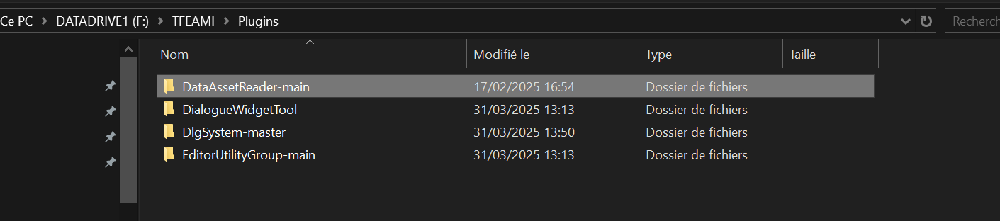
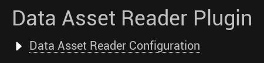
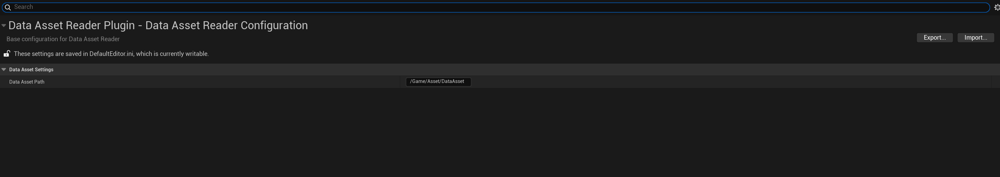
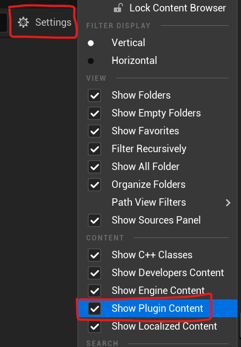
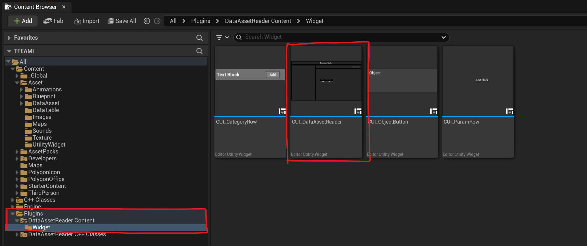
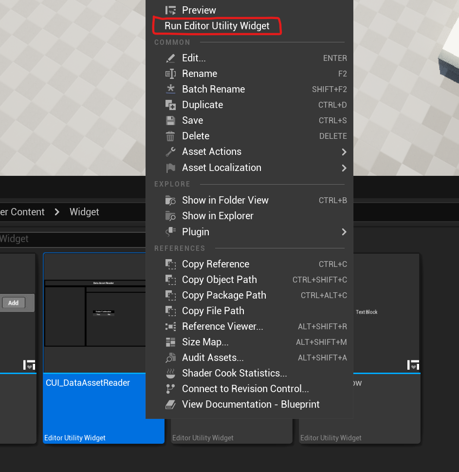

# Data Asset Reader
Unreal Engine 5.5

This plugin allow you to read and modify all data asset of your game directly inside one window without opening multiple data asset 

## Installation

Install plugin by drag and dropping the Data asset editor root folder inside your Plugins project directory

## Project Settings

Inside the project Settings in unreal engine you will have a new category called : Data Asset Reader plugin

- Asset path : The path folder where you have your data assets 
 Example : /Game/Data

## How to use
Inside the content folder of the plugin you will find multiple Editor utility widget you can open the Data Asset Reader after the setup of the path inside the project setting and then access your data asset directly in the tool

## Authors

- [@Reyz](https://github.com/Renan-Yilmaz)

